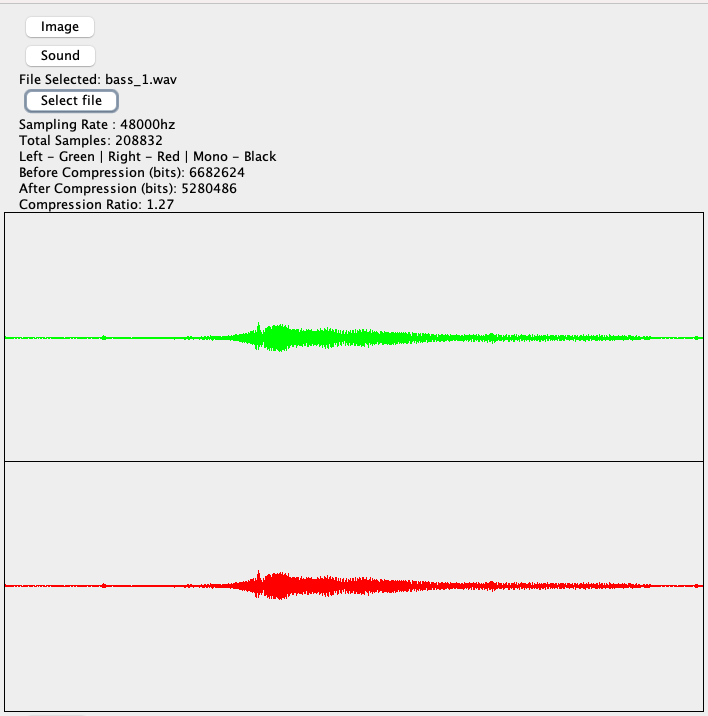
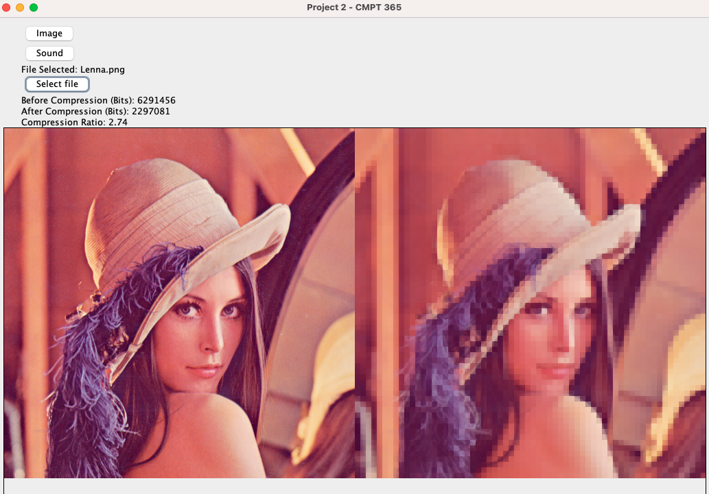

# Media Compression Project - CMPT 365

This Java application provides functionality to analyze and compress both sound and image files. It features a graphical user interface (GUI) built with Swing.

## Features

- **Sound Analysis and Compression**: Analyze WAV sound files to display sampling rate, total samples, and other information. Apply compression of sound;
- **Image Analysis and Compression**: Analyze PNG image files to display compression ratios and other information. Compress images and visualize the results.

## Getting Started

### Prerequisites

- Java Development Kit (JDK) installed on your system.
- An integrated development environment (IDE) such as IntelliJ IDEA or Eclipse (optional but recommended).

### Installation and Usage

1. Clone or download the repository to your local machine.
2. Open the project in your preferred IDE.
3. Compile and run the `GraphicJFrame.java` file.
4. Use the GUI to select sound or image files, analyze them, and apply compression if desired.

## Usage

1. Launch the application.
2. Choose between analyzing sound or image files by clicking the respective buttons.
3. Select the file you want to analyze or compress.
4. View the analysis results and compression ratios.
5. Optionally, apply compression to the file.
6. Exit the application when done.

## Compression Method

The Media Compression Project utilizes a combination of techniques for compressing both sound and image files:

- **Image Compression**: The project employs Discrete Cosine Transform (DCT) for transforming image data from the spatial domain to the frequency domain. Following the transformation, quantization is applied to reduce the precision of the transformed coefficients. The quantized coefficients are then entropy encoded using Huffman coding to achieve lossy compression. The process involves run-length encoding of zigzag-ordered DCT coefficients followed by Huffman encoding, resulting in efficient compression.

- **Sound Compression**: For sound files, the project employs similar techniques. Discrete Cosine Transform (DCT) is applied to transform sound data, followed by quantization and entropy encoding using Huffman coding. The process reduces the precision of the transformed coefficients and encodes them efficiently to achieve compression while maintaining perceptual audio quality.

These compression methods aim to reduce file size while preserving essential characteristics of the media, ensuring efficient storage and transmission of sound and image data.

## Example

### Sound Compression

### Image Compression

